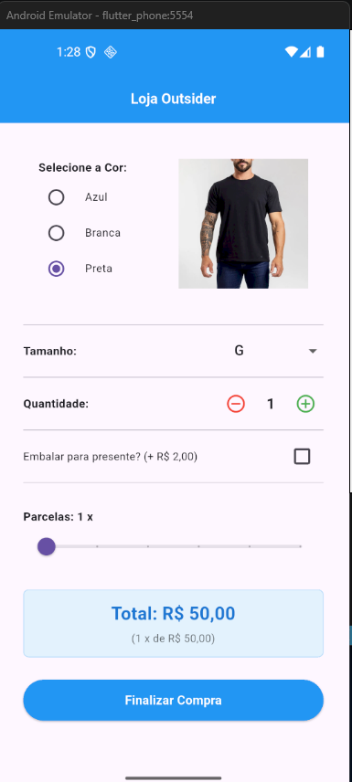

# Loja Outsider

Projeto desenvolvido em Flutter para simular uma tela de compra de camisas da Loja Outsider.

A aplicação permite selecionar a cor da camisa, visualizar a imagem correspondente, escolher tamanho, quantidade, opção de embalagem para presente, número de parcelas e calcular automaticamente o valor total da compra.

## Tela do Projeto

<p align="center">
  
</p>

## Funcionalidades

* Seleção da cor da camisa;
* Alteração automática da imagem conforme a cor selecionada;
* Seleção do tamanho da camisa;
* Controle de quantidade com botões de adicionar e remover;
* Opção para embalar como presente;
* Seleção da quantidade de parcelas;
* Cálculo automático do total da compra;
* Exibição do valor da parcela;
* Botão para finalizar a compra;
* Mensagem de confirmação ao finalizar.

## Tecnologias Utilizadas

* Flutter
* Dart

## Conceitos Praticados

Durante o desenvolvimento deste projeto, foram praticados conceitos importantes de Flutter e Dart, como:

* `StatelessWidget`;
* `StatefulWidget`;
* `setState`;
* `MaterialApp`;
* `Scaffold`;
* `AppBar`;
* `Column`;
* `Row`;
* `Image.asset`;
* `RadioGroup`;
* `RadioListTile`;
* `DropdownButton`;
* `Checkbox`;
* `Slider`;
* `Container`;
* `ElevatedButton`;
* `SnackBar`;
* Criação de models;
* Conversão de JSON;
* Separação de responsabilidades com Service, Repository e ViewModel.

## Estrutura do Projeto

```text
lib/
  main.dart
  app/
    app_widget.dart
    data/
      camisa_model.dart
      camisa_repository.dart
      camisa_service.dart
      compra_model.dart
    view/
      home_view.dart
      home_viewmodel.dart
```

## Descrição dos Arquivos

### `main.dart`

Arquivo principal da aplicação.
Ele inicia o app chamando o `AppWidget`.

### `app_widget.dart`

Arquivo responsável pela configuração inicial do aplicativo, como o `MaterialApp`, título e tela inicial.

### `camisa_service.dart`

Simula uma busca de dados, como se fosse uma API.
Retorna os dados da camisa em formato JSON.

### `camisa_repository.dart`

Responsável por buscar os dados no service, converter o JSON em `Map` e transformar esse `Map` em um objeto `CamisaModel`.

### `camisa_model.dart`

Representa os dados da camisa, como:

* Preço base;
* Valor do embrulho para presente;
* Quantidade máxima de parcelas;
* Juros por parcela;
* Tamanhos disponíveis;
* Modelos de camisa.

Também possui a classe `ModeloCamisa`, responsável por representar cada modelo com cor e caminho da imagem.

### `compra_model.dart`

Representa a compra feita pelo usuário.

Essa classe concentra os cálculos da compra, como:

* Subtotal dos produtos;
* Valor do embrulho;
* Juros;
* Total;
* Valor da parcela.

### `home_viewmodel.dart`

Faz a ponte entre a tela e o repository.

Fluxo:

```text
HomeView → HomeViewModel → CamisaRepository
```

### `home_view.dart`

Tela principal do app.
Nela o usuário escolhe as opções da compra e visualiza o valor total.

## Fluxo da Aplicação

```text
main.dart
↓
AppWidget
↓
HomeView
↓
HomeViewModel
↓
CamisaRepository
↓
CamisaService
↓
CamisaModel
```

Depois, com as informações escolhidas pelo usuário, o app cria um `CompraModel` para calcular o valor final.

## Regras de Negócio

* O valor base da camisa é R$ 50,00;
* A quantidade mínima permitida é 1;
* O valor do presente é somado somente quando a opção de embalagem é marcada;
* O número de parcelas é limitado pelo valor definido no model da camisa;
* O valor total é calculado com base no preço da camisa, quantidade, presente e juros;
* O valor da parcela é calculado dividindo o total pelo número de parcelas.

## Como Executar o Projeto

Clone o projeto:

```bash
git clone https://github.com/mariannaabbate-svg/projeto_loja_outsider.git
```

Entre na pasta do projeto:

```bash
cd projeto_loja_outsider
```

Instale as dependências:

```bash
flutter pub get
```

Verifique se existe algum problema no código:

```bash
flutter analyze
```

Execute o projeto:

```bash
flutter run
```

## Status do Projeto

Projeto em desenvolvimento.

Funcionalidades principais já implementadas:

* Layout da tela de compra;
* Seleção de cor;
* Troca dinâmica da imagem;
* Seleção de tamanho;
* Controle de quantidade;
* Opção de presente;
* Parcelamento;
* Cálculo total;
* Botão de finalização.

## Autora

Desenvolvido por Marianna Abbate.


